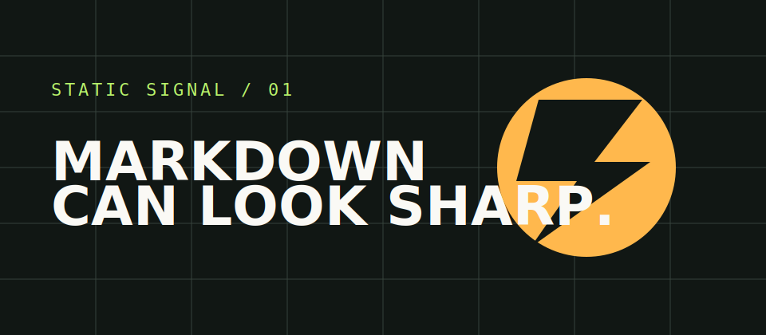

This page is not framework documentation. It is a visual test bench for the content system.

## Code and commands

Inline code looks like `cargo add something`, while fenced code receives syntax highlighting:

```rust
#[derive(Debug)]
struct TinySignal {
    label: &'static str,
    ready: bool,
}
```

## Lists and tasks

- Plain lists remain easy to scan.
- Links can point back to the [documentation home](../index.md).
- Local assets can sit beside the Markdown.

- [x] Scan Markdown files
- [x] Build static pages
- [ ] Write the real documentation later

## Tables

| Feature | Build time | Browser runtime |
| --- | ---: | ---: |
| Markdown parsing | Yes | No |
| Directory scanning | Yes | No |
| Client navigation | No | Yes |

## Local image



### A smaller heading

The right-hand outline includes both second- and third-level headings.
